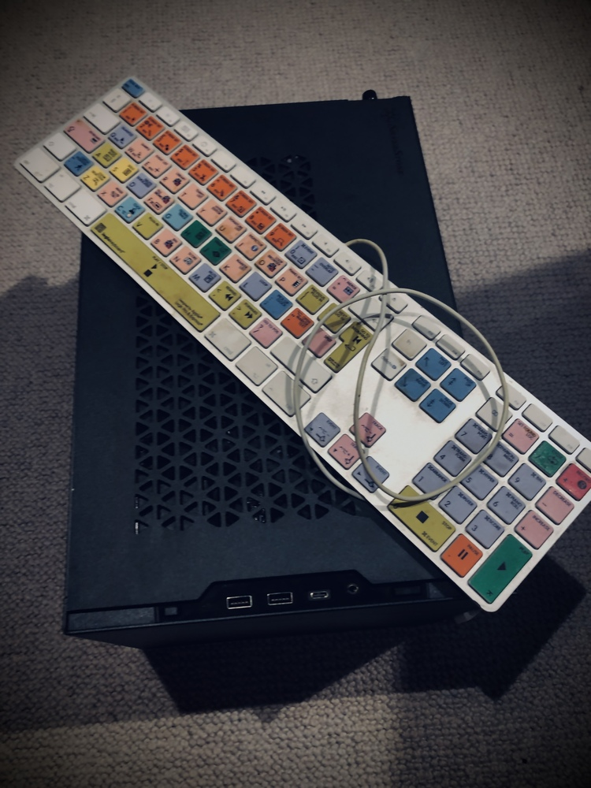

## Building An Unbuntu Linux Development Server

This describes a mini-ITX X570 build running Unbuntu Server 20.04 with a spec of AMD Ryzen 16 cores, 64GB RAM and 2TB SSD M.2 [PCie4.0](https://www.onlogic.com/company/io-hub/your-ultimate-guide-to-understanding-pcie-4-0/).

The build was intended to provide maximum performance with a small footprint and to be as quiet as possible.

Both the motherboard board and processor can run hot so cooling must be carefully conidered so an AIO water cooling solution is a must for this type of build.  

Budget was approximately £2,400 (= $3,300) - cost could be reduced by choosing cheaper processor, less RAM and a cheaper SSD option (although the board has PCIe4.0 which is a major plus)

---- 

### Build Components:
- [AMD Ryzen 9 5950X 16 Core AM4](https://www.scan.co.uk/products/amd-ryzen-9-5950x-am4-zen-3-16-core-32-thread-34ghz-49ghz-turbo-72mb-cache-pcie-40-105w-cpu)
- [ASRock X570 ITX/TB3](https://www.asrock.com/mb/AMD/X570%20Phantom%20Gaming-ITXTB3/#BIOS)
- [Corsair iCUE 100i PRO XT](https://www.amazon.co.uk/gp/product/B0829RTMKY)
- [Crucial Ballistix RGB 64GB (2x32GB) DDR4 PC4-28800C16 3600MHz Dual Channel Kit MY-20V-CR](https://www.overclockers.co.uk/crucial-ballistix-rgb-64gb-2x32gb-ddr4-pc4-28800c16-3600mhz-dual-channel-kit-my-20v-cr.html)
- [WD Black SN850 2TB M.2 PCIe 4.0 Gen4 NVMe SSD/Solid State Drive](https://www.scan.co.uk/products/2tb-wd-black-sn850-m2-2280-pcie-40-x4-nvme-ssd-3d-nand-7000mb-s-read-5100mb-s-write)
- [Silverstone SUGO 15 Mini ITX Case](https://www.scan.co.uk/products/silverstone-sugo-15-black-mini-itx-cube-chassis-1x-120mm-fan-usb-type-c-mdtx-mitx)
- [2 x Noctua NF-A12x25 PWM, Premium Quiet Fan, 4-Pin (120mm, Brown)](https://www.amazon.co.uk/gp/product/B07C5VG64V)
- [Seasonic PRIME Fanless PX500 Power Supply](https://www.scan.co.uk/products/500w-seasonic-prime-fanless-px-full-modular-80-plus-platinum-sli-crossfire-single-rail-41a-atx-psu)
- [Akasa M.2 SSD Aluminium Heatsink Cooler (2021 Update)](https://www.scan.co.uk/products/akasa-aluminium-passive-cooling-kit-for-m2-2280-ssd)
- [SilverStone SST-CP11-300 - Ultra Thin SATA III 6 Gbps Cable, laterial 90° angled, super low profile](https://www.amazon.co.uk/gp/product/B00L6M0LQE/ref=ox_sc_act_title_1?smid=A3P5ROKL5A1OLE&psc=1)
- [Phobya - 3-Pin to 4-Pin PWM Fan Adaptor 30cm](https://www.amazon.co.uk/Phobya-3-Pin-4-Pin-Adaptor-Black-Sheathed/dp/B004X2X4MW)

### Build Notes:
- The above build is a MiniITX build which crams a lot into a very small space so care must be taken during assembly particularly around mounting the cooler and also the SATA cables. The SATA ports push right up against the SUGO's housing for the power supply so ultra-thin, 90° angled SATA cables are recommended 
- The ASRockX570 doesn't use an AM4 mounting bracket but instead uses LGA 115x mounting. (This mounting is included with the iCUE100 although it may look too big it is actually adjustable). Note that I tried mounting an NZXT Kraken X53 and an Arctic Cooler Liquid Freezer II 240 and both of these wouldn't fit due to other heatsinks on the motherboard!
- I replaced the fans on the iCUE100 with the Noctua to reduce noise and they are very quiet. 
- The Corsair iCUE100i normally relies on iCUE software but this is for Windows only - there is [OpenCorsairLink](https://github.com/audiohacked/OpenCorsairLink) which a Linux port and also the newer [liquidctl](https://github.com/liquidctl/liquidctl) 
- The power for the Corsair far is 3 pin - you can connect 3 pin to 4 pin - but the conneciton remains loose so a 3-pint to 4-pin adapter is recommended
----

### Unbuntu installation
- Unbuntu Server 20.04.03 was installed via a USB and downloaded the ISO [here](https://releases.ubuntu.com/20.04.3/ubuntu-20.04.3-live-server-amd64.iso?_ga=2.253174090.23663168.1631360313-232329434.1628434012) - the desktop Ubuntu 20.04.3 LTS should also work 
- From OSX I used [BalenaEtcher](https://www.balena.io/etcher/) to create the bootable USB
- Initially I tried installing an older version of Unbuntu which appeared to fail during partitioning
- Once Unbuntu was installed I saw problems with Unbuntu crashing so BIOS changes needed to applied

----

### BIOS & Boot Loader Changes
- Set RAM speed/voltage -  Corsair Ballistix runs at 3600MHZ and requires 1.35V
- H/W Monitor - CPU Fan - Set these to "Performance Mode" 
- Other required BIOS changes were described [here](https://askubuntu.com/questions/1234299/amd-ryzen-5-3600-ubuntu-20-04-problems/1241636#1241636)
    - Advanced / CPU Configuration / SMT Mode: Disabled (very important, even only turning SMT off made CPU stuck soft lockup happened much less frequently.)
    - Advanced / ACPI Configuration / Deep Sleep: Disabled
    - Advanced / Onboard Devices Configuration / Intel Wifi: Disabled (possible problems?)
    - Advanced / Onboard Devices Configuration / BW On/Off: Disabled (bluetooth possible problems?)
    - Advanced / AMD CBS / Common CPU Options / Global C State Control: Disabled 
    - Advanced / AMD CBS / Common CPU Options / Power Idle Control: Typical Current Idle (that disable C6 states)
- Description of C-States [here](https://askinglot.com/goto/308341A4)
- Boot parameters need to passed to Grub (which is Unbuntu's boot loader) - more info on Grub configuration [here](https://www.gnu.org/software/grub/manual/grub/html_node/Simple-configuration.html#Simple-configuration)
```shell
  sudo nano /etc/default/grub
  GRUB_CMDLINE_LINUX_DEFAULT="quiet splash pci=assign-busses apicmaintimer idle=poll reboot=cold,hard"
  sudo update-grub
```

- Possibly add  `acpi=ht irqpoll` => ht = hyperthreading and irqpoll will make the kernel poll for interrupts 

### Common Problems
- **Wired network stops working** and doing `lshw -C network`  shows `*-network DISABLED`
  Solution: `rm /usr/lib/NetworkManager/conf.d/10-globally-managed-devices.conf`


